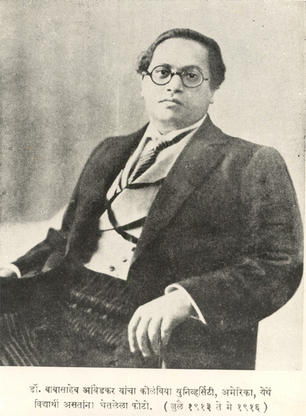

# This repository is dedicated to the father of the Indian constutition, his team and all colonial freedom fighters  

#### Aim
This project aims to leverage technology to create awareness and reach of constitutional legal rights to the people of India. As a first step we are creating markdown of Indian Constitution. Th

#### Source
Constitution available in this repository is based on the most recent text [here](http://legislative.gov.in/sites/default/files/COI-updated.pdf)

#### Contribution
Everyone is encouraged to contribute to the repository. Please test the preview in your local development environment before creating PR

#### Guidance for contribution
1. Try to stick to the format in the source PDF document
2. Please use the format ***page<PAGE_NUMBER>footer<REFERENCE_NUMBER>*** as footer identifier
3. Please use the format ***page<PAGE_NUMBER>sup<REFERENCE_NUMBER>*** as superscript identifier
4. Each header should have a corresponding footer at the end of page. If a text or point in the constitution spans multiple pages in the original PDF, its ok to jam it together as a single page in markdown for readability
5. Please refer to already existing pages as reference
6. If you have any suggestions or concerns or need calrification please raise a ticket, it will be addressed based on availability of the community memebers
7. In order to provide transparency, all the conversations relevant to the creation and maintenance specific to this repository should be in public forum
8. Any deviation from original the text in constitution may result in ban from contribution

